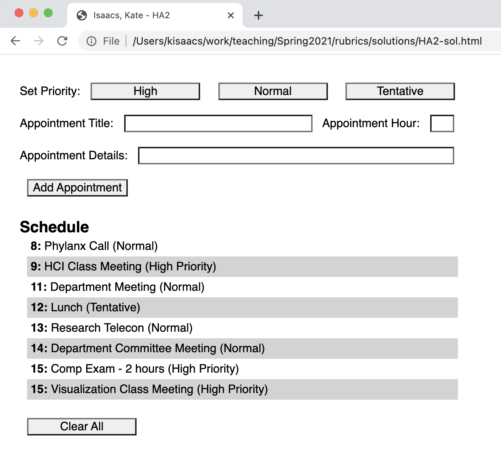

## Homework Assignment 2

Version History: 

- 2020/01/30 Released

In this assignment, we are exercising:

- GUI programming in HTML/CSS/Javascript
- the MVC design pattern as shown in class

Note this assignment is **not** about UI design. This assignment is about
getting the mechanics of the MVC discussed in class, as well as learning about
Javascript, HTML, and CSS by doing. Design choices in this assignment reflect
the goal of learning and practicing these technologies and architecture rather
than interface design. Some "bad" design choices are made to prevent the
assignment from getting more complicated than necessary. We will consider
interface design choices in other assignments.

Do not use any Javascript libraries. The HTML, Javascript, and CSS should be
in separate files. No style information should be in the HTML tags. Do not use
HTML tags like `
`, `<b>`, or `<i>` to alter visual appearance.
Programmatically added SVG elements may have style attributes.

This assignment is due Tuesday, February 9th at 11:59 PM.  Use the following
link to create your github repository for this assignment:
[https://classroom.github.com/a/geI87X48](https://classroom.github.com/a/geI87X48)
This will be initialized with the JS file `HA2.js.` Your git repository at the
time of submission should contain one HTML file named `HA2.html` as well as a
CSS file `HA2.css` and a JS file `HA2.js`.

The webpage should consist of a set of controls and a grid drawing area. The
title of the webpage should be "Last Name, First Name - HA2" where your last
name and first name are used.

  
  &nbsp;
  

### Day Planner

In this assignment, we are creating a simple day planner as shown in the image
above. 

This assignment should be implemented such that the MVC design pattern, as
demonstrated in class, is followed. Your repository will be pre-populated with
a Javascript file with the functions you should use to create this. You will
need to fill in the JS code, as well as create the HTML and CSS files.

#### Functionality

An appointment can be added using a text inputs and clicking the `Add
Appointment` button. On click, the appointment is added to the schedule.
Appointments should be shown ordered by hour. Any time 'Add Appointment' is
clicked, the text fields should be clicked.

The hour field should be an integer between 0 and 23. If the hour field is
anything else, nothing should be added. Multiple appointments may be added at
the same hour.

The title field cannot be empty. If the title field is empty, nothing should
be added.

On load, the day planner is empty and the default priority is 'Normal.' The
user can change the priority by clicking on the buttons at the top.
Appointments will have the priority last clicked. Switching priorities should
not clear the text input.

Note that each item is associated with one of three categories: `Work`,
`School`, or `Play`. The item will have the category associated with the last
category button clicked. On load, the default category is `Work`. Switching
the category should not clear the text input.

When a user clicks on a row in the day planner, a secondary detail view is
shown to the right. This detail view lists all properties of the appointment
in the format of a bold property label followed by the value. Clicking on the
row a second time will clear this view.

The entire day can be cleared by clicking the `Clear All Appointments` button.
This action should also clear all text inputs and selected items, but not
clear the priority setting.

**A video showing some of these functions is available in the `movies`
directory.** See [PM1.mov](movies/PM1.mov)

#### Style

There should be at least 10 pixels between the edges of the browser window and
your elements.

The text of the word 'Schedule' is 16 pt sans-serif, bold. All other text,
including on the buttons, is 12pt sans-serif. As demonstrated in class, you
may need to add a `-webkit-appearance: none;` or other line to your CSS
depending on the browser and OS you use.

All buttons are 150 pixels wide with centered text. 

All inputs (e.g., text, buttons) have a 10 pixel margin.

The first row has the priority buttons. 

The second row has the appointment title with a 250 pixel wide text input and
the appointment hour with a 25 pixel wide text input.

The third row has appointment details with a 425 pixel text input. 

Appointments in the day planner should appear with their hour in bold followed
by a colon and a space, then the title of the appointment, then a space, and
then the priority in parentheses. These appointments are given 600 pixels of
width. Each appointment has uniform padding of 5 pixels and a left margin of
10 pixels.

The detail view, when clicked, shows each property of the appointment in a new
row, with the property name in bold, followed by a colon, and then the
property value. Along the left side is a 5 pixel gray column which
differentiates this view from the Schedule view. The Detail view should align
vertically with the Schedule view. My example has an additional internal 'ID'
property which I am using to differentiate duplicates. This feature is not
required by you and will not be graded in this assignment. 

### Organization

Your Javascript code should demonstrate the Model-View-Controller pattern as
we went over in lecture. 

The application and state data should be kept by the Model which notifies any
Views upon change.

Any changes to the DOM should be managed by the View. However, the view should
not maintain state between renderings.

The Controller should act as the mediator, making changes to the model as
notified by the View. The Controller does not modify the View.

### Grading

This homework assignment will be graded on adherence to MVC and the given
starter code, functionality, and style with approximate weights of 40%, 40%
and 20% respectively. (These are approximate because it can be argued what
parts of the assignment should be counted in one category versus another. For
example, the functionality is required to demonstrate the MVC and the MVC is
required to make the functionality work.)

### Where to Start

You are build this assignment in whatever way makes the most sense to you. If
you're having trouble getting started, I recommend starting with minimal
features and working your way up. You can make use of `console.log` to see
which JS functions are being called with what values. Here is one example of
this strategy:

1. Create the HTML/CSS layout for what is shown.
2. Add the JS functionality for 'Add Appointment' with ONLY the appointment
   title. Test to make sure it works. All appointments should have Normal priority at first with some default hour. The other fields will be present in the HTML but not do anything. Don't worry about style additions like bolding and background color in the Schedule yet.
3. Add the JS functionality for the appointment hour. See the
   MDN page for sort() to help sort the appointments. Test.
4. Add the JS functionality for changing the priority. Test.
5. Add the JS functionality for Clear All. Test.
6. Add the JS functionality for the Details view on click. Don't worry about
   having it disappear on second click at first.
7. Add the JS functionality to make the Details view disappear if you click
   on the item again.
9. Add the JS functionality for appointment details. You can now test this
   since it should appear in the details view. Test.
9. Go back and fix any style issues in the Schedule and Details views.
10. Test the whole system. What corner cases are there? What bad inputs are
   there? Does your system still work?

In this example, you do not need to write or add the JS for features like the
clear button or details until the rest of the system is working.
