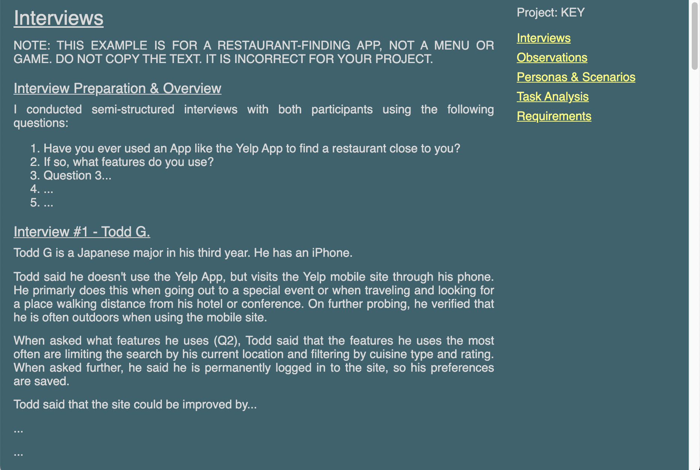
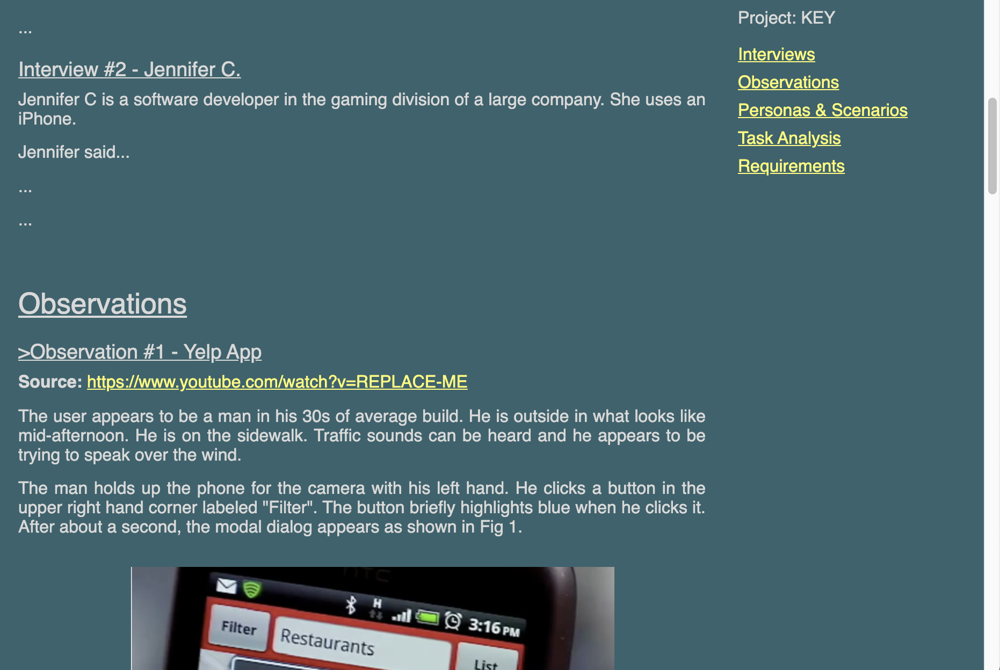
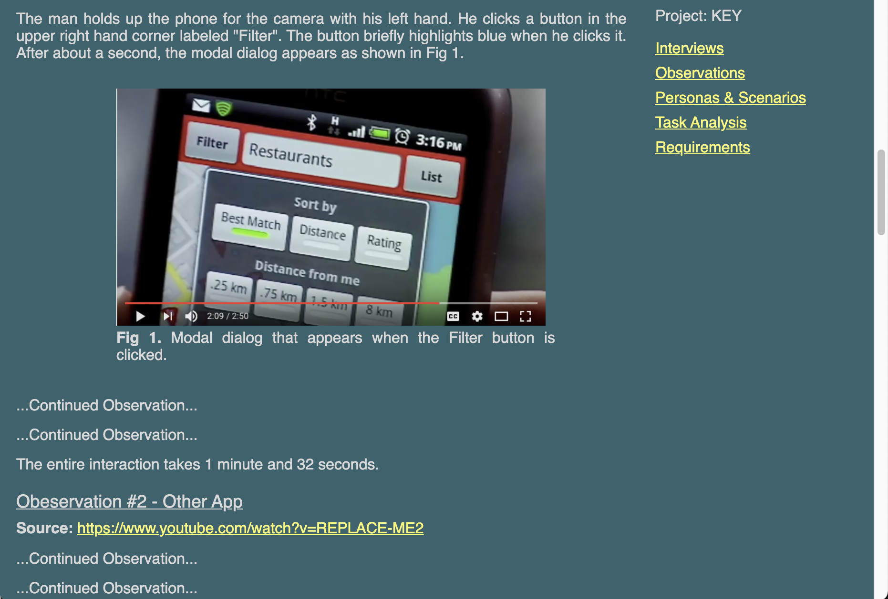
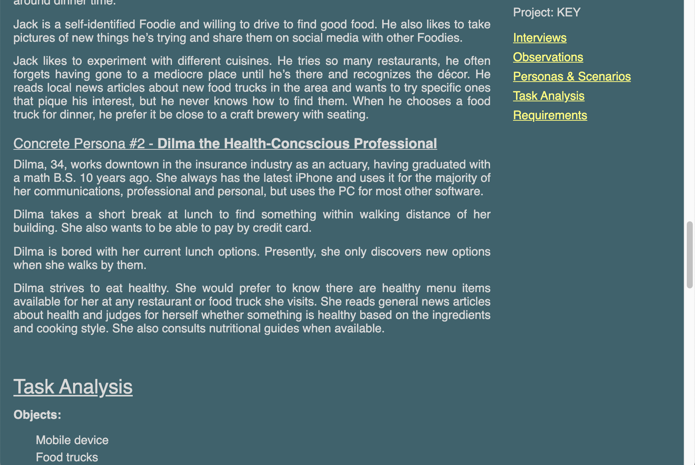
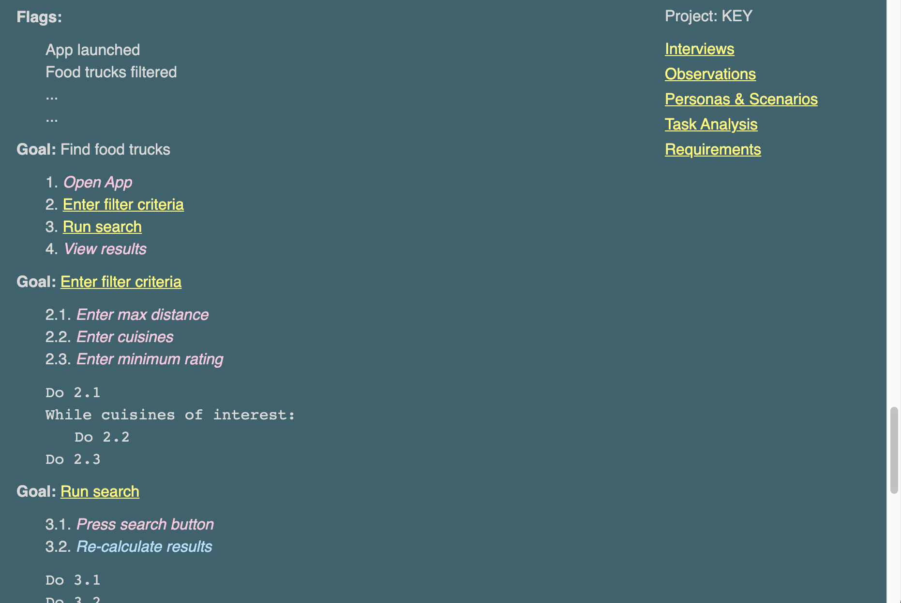
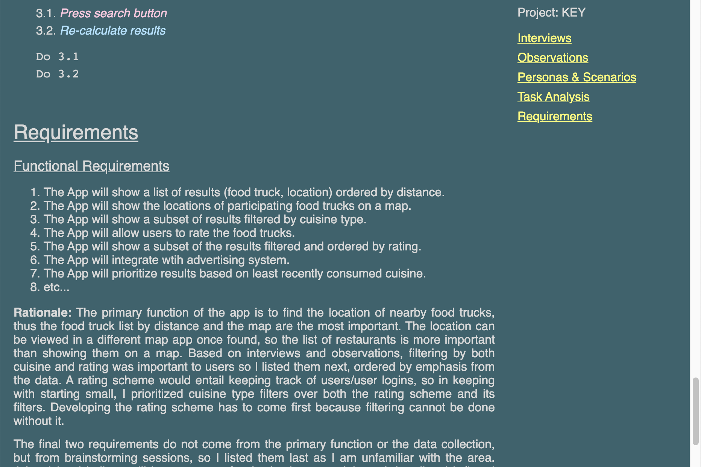

## Project Milestone 1 - Due Tuesday 2021/02/02 11:59 PM

Version History: 

- Released 2020/1/18

In this milestone we are:

- Choosing your project focus for the semester.
- Gathering data to support the creating of initial project requirements.
- Performing User and Use analysis for the project.
- Stating initial requirements.
- Getting a little more HTML practice.

You have a choice between two projects:

- MENU: an online ordering interface for a food delivery/takeout service.
- GAME: an inventory management interface for a video game, such as those seen
  in the Borderlands series, Kingdom Hearts series, and many role-playing games.

**This choice will carry through all of your project milestones. You will not
be able to change projects after this selection.**

The artifacts generated should be presented in a single HTML page as described
below. No style information should be in the HTML tags. Do not use HTML tags
like `
`, `<b>`, or `<i>` to alter visual appearance. If you use a tag,
it should be appropriate to the content described.

Use the following link to create your github repository for this assignment:
[https://classroom.github.com/a/LXh68AiA](https://classroom.github.com/a/LXh68AiA).
At the time of submissions, your git repository should contain one HTML file
named `PM1.html` as well as a CSS file. It should also include any images or
media needed for the report and `PM1.html`.

## Content

In the upper right, state which of the two projects you have chosen, with
`Project: [KEY]` where `[KEY]` is `MENU` or `GAME`.

### Data Gathering 

#### Interviews (18 pts)

Conduct a short interview with two people not in this class regarding their
use and interest in the project subject matter (online menu or games with
inventory). **This interview may be conducted remotely. Please observe social
distancing guidelines.**

Document the type of interview you chose and what preparation (e.g.,
questions) you developed prior to the interview.  These should go under a
subsection header `Interview Preparation & Overview`.

Document each interview by describing the person interviewed and the relevant
answers you received from the interviewee. Each interview report should be
preceded by a sub-section header `Interview #1 - Interview Name` or `Interview
#2 - Interview Name`. You do not need to include the interviewee's real name.
You can instead go with a short description to differentiate them, for example
`Interview #1 - CS Student.`

All Interview content should be under the Section Header `Interviews`.

Interview content will be graded based on correctness in describing the type
of interview, preparation, appropriateness of questions, and completeness of
data gathered: No Answer, Minimally Detailed, Detailed, Thoroughly Detailed.

#### Observations or Existing System Analysis (18 pts total, 9 pts each observation or alternatives)

In non-pandemic iterations of this course, this section is typically two
observations. However, observations are difficult while maintaining social
distancing. If you you have a **safe** method for doing an observation (e.g.,
roommates within your social distancing bubble), you may do so,
but there are several remote options as well. Your choice of option will NOT be
factored into your grade. You can mix and match as necessary. For example, you
could choose two and do one of each or you could do two of a single option.

1. Conduct a live observation of a person (e.g., roommate) using an example of
   the interface type for your project.

2. Conduct a remote/online observation of a person using an example of the
   interface type for your project (e.g., friend sharing stream, Twitch stream)

3. Review a recording of a person using an example of the interface type of
   your project. **Note: marketing videos of a product do not count. The idea
is to see how a target user would respond, not a choreographed expert.** If
you use this option, the link to the video (e.g., Youtube link) should be
included.

4. Use the interface type yourself and take detailed notes of your findings.
   This option is the least ideal for the original purpose of this section,
but is still a valid method for understanding issues in designing your
interface.

Do not observe people without permission. Do not do anything that will make
things difficult for the venue (e.g., restaurant, game club) or get you in
trouble. Do not get in the way of paying customers.

**Be sure you are observing an interface analogous to your project. For
example, don't observe a book buying interface rather than a food menu if you
are doing the menu project.**

Yoour data should record the who, what, and where questions discussed in
class. They should clearly separate facts from observations. Pay attention to
how quickly the user is able to perform the actions and how many mistakes they
make. Where do they seem to pause? Where do they seem to have difficulty?
Describe the interface in question. Use at least one sketched figure or screen
shots to help describe what you observe. (You may sketch a figure on paper and
take a photo of it.) If you are observing a video, greater detail is expected
because the video allows you to pause and replay interactions.

Each observation report should be in a separate sub-section with the title of
the form `Observation #? - Description`. Like the interviews, the description
should differentiate the observations. If the observation was done off of a
video, a link to the video should be provided next to a bolded `Source:`.  

All Observations content should be under the Section Header `Observation`.

Observation content will be graded on correctness, appropriateness, and
completeness of data gathered: No Answer, Minimally Detailed, Detailed,
Thoroughly Detailed.

### Analysis

#### Personas & Scenarios (18 pts)

Develop one abstract user, describing the general population served by the
system. Then develop and describe two concrete personas with the main scenario
of using the system for ordering a meal.

Right beneath the section heading, declare the abstract user and abstract
scenario as shown in the sample. 

Each persona should be under its own sub-section header of the form `Concrete
Persona #? - Description` as shown in the sample.

All Personas & Scenarios content should be under the Section Header `Personas
& Scenarios`.

Personas will be graded on appropriateness and thoroughness. The two personas
should be substantially different from one another. 

#### Task Analysis (18 pts)

Perform hierarchical task analysis for the following task depending on the
project you chose:

- MENU: Ordering a meal. 
- GAME: Choosing an piece of armor/accessory to equip. 

Describe the objects, lists, and flags in the domain of your task analysis.
Each list should be titled in bold.

Write all of the tasks and subtasks as a list. In the sample, the task numbers
are specified by hand, not with the `ol` functionality. No bullets should be
shown. For each sub-task (including non-leaf sub-tasks), include a plan. The
plans should be below the list for each goal. Each plan should have monospace
text. The title of each node (except the top one) should be a link to its
plan.

Actions in the list which are expanded upon as nodes should be a link to that
node in the HTML page. Actions which do not have nodes (e.g., leaf actions)
should be italic. The color should explain why you chose not to decompose the
node--`#FFC7E0` means it is an atomic user action, `#ADE2FF` means it is an
atomic system action.

All Hierarchical Task Analysis content should be under the Section Header
`Task Analysis`.

The content of this will be graded on appropriateness of the actions and
decomposition, appropriateness of labeling any action atomic, and
thoroughness.

### Requirements (18 pts)

Create two lists, one for functional requirements and one for non-functional
requirements. Each list should have at least five items. Order each list by
importance--the most important requirements first. In text below the lists,
explain the rationale for your ordering.

Both requirements lists should be numbered, with the type of the requirement
underlined at the top. The rationale should be listed below with the word
"Rationale" in bold. The rationale should cover all the requirements in the
list. Use a sub-section header for both `Functional Requirements` and
`Non-Functional Requirements.` 

All Requirements content should be under the Section Header `Requirements`.

The content will be graded on the appropriateness of the requirements, the
correctness of the categorization of requirements, and the appropriateness and
thoroughness of the rationale for the ordering.

### Formatting (10 pts)

Please write your report in the format described below. Include any formatting
listed above, such as the use of monospace, bolding, and color in the task analysis. 

The title should be "FamilyName, PreferredName - PM1" where FamilyName is your
family name and PreferredName is what you prefer to be called.

Your report should have static menu on the right that links to each of the five
content sections: Interviews, Observations, Personas & Scenarios, Task
Analysis, and Requirements. "Static" in this case means the menu should not
scroll off the screen when the page is scrolled.
 
The page should have a `#37636D` background color and `#D9D9D9` text.

Links should be `#FFFD6B`.

All images should be displayed as figures as follows:
 
- The image will should appear 450 pixels wide.
- There will be a caption of the form `Fig #: Caption text`. The `Fig #:`
  portion should be bold`. The rest of the caption should match the
rest of the content text.
- The entire figure will be centered within the 640 pixels of content.
- Clicking on an image should diplay the full-sized image.

The main text font should be 12 point sans-serif. All paragraphs should be
justified. The main content should be 640 pixels wide. 

The links in the menu should have at least 8 pixels of spacing between them.
They should appear below the statement of which project you chose, which
should be in bold.

There should be a 30 pixel buffer between the menu and the content. There
should be at least 35 points of space between each section of the content.
Content, starting with Interviews, should start at the top without a large
35 point space.

Section headers should be 20 points and sub-section headers should be 14
point. Both should underlined. There should be 10 points of spacing between each
section header and its content. There should be 7 points of spacing betwen
each sub-section header and its content. There should be 14 points of spacing
between each subsection. There should be 10 points of spacing between each
paragraph.

The Task Analysis, Interviews, and any other lists should have 5 pixels of
spacing between each item and should be indented 30 pixels for each level of
the hierarchy as shown.

Requirements lists should have the default numbered list style.

A movie demonstrating the report format is available [here:
PM1.mov](movies/PM1.mov)

  
  &nbsp;
  
  &nbsp;
  

  
  &nbsp;
  
  &nbsp;
  

