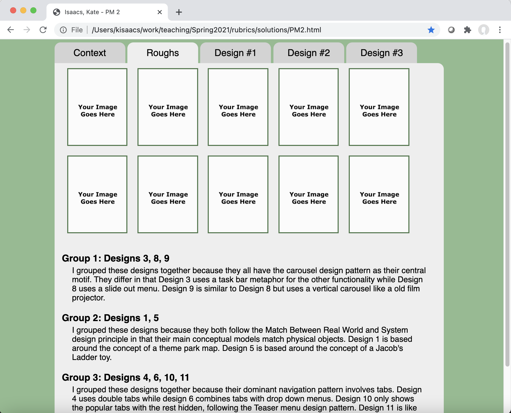
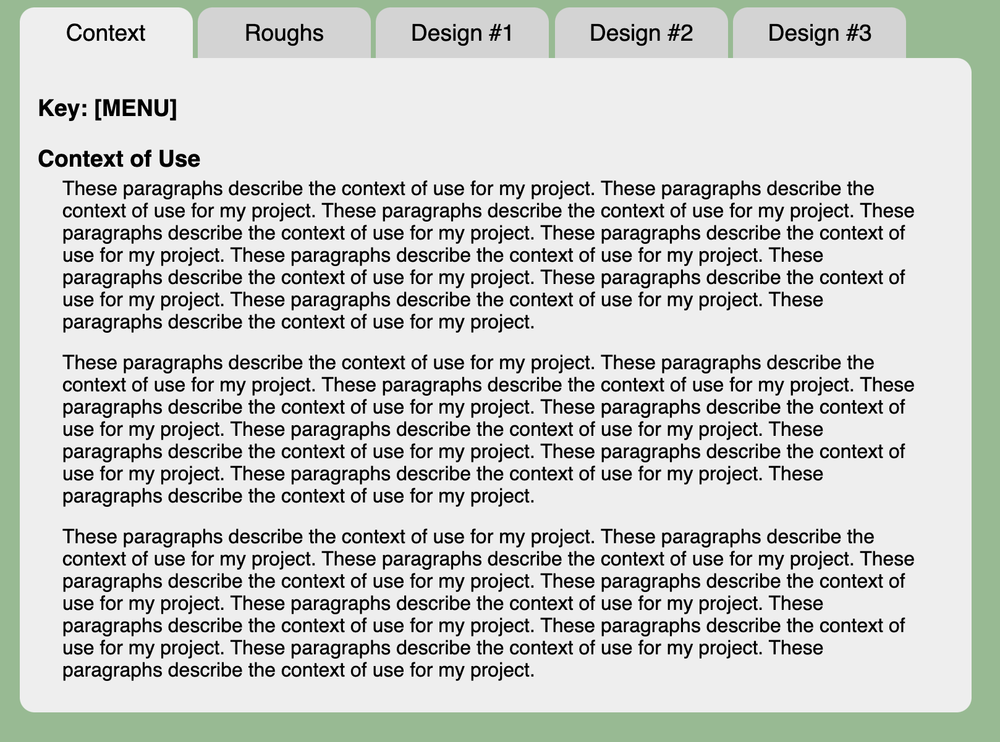
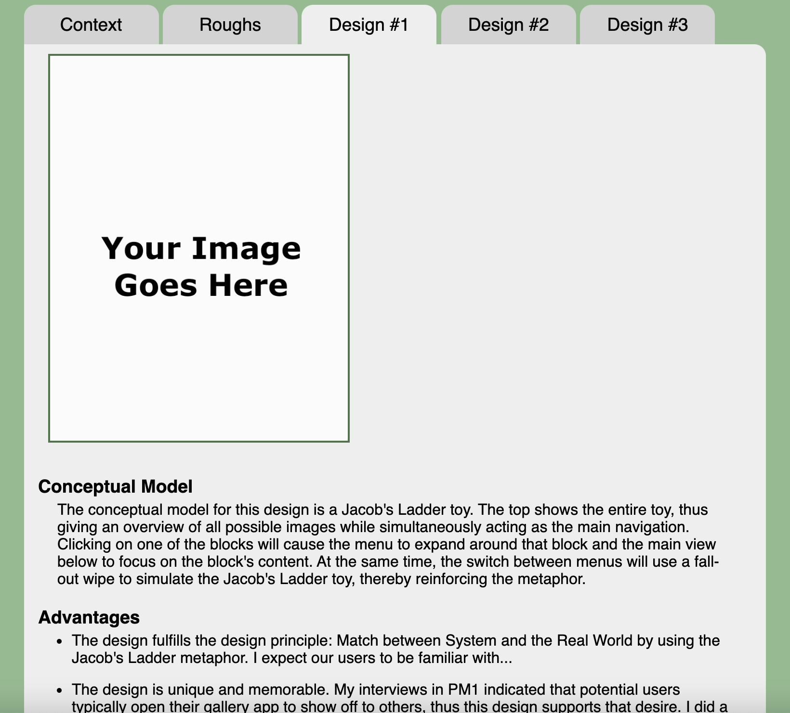
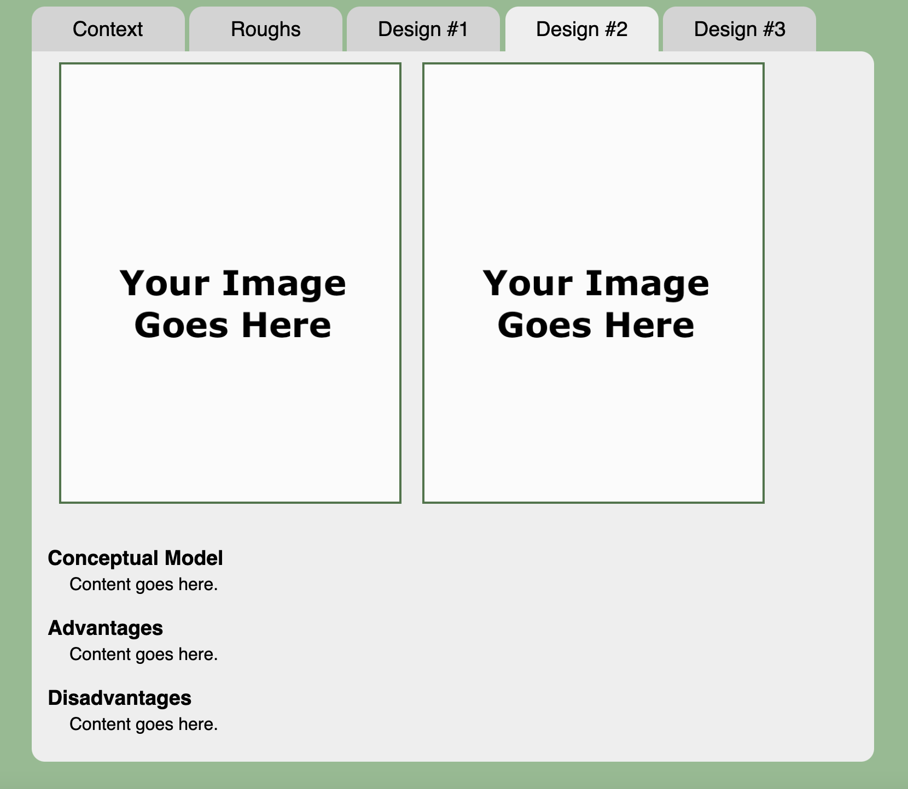

## Project Milestone 2 - Due Tuesday 2/16 at 11:59 PM

Version History: 

- Released 2020/02/05

The subject of the project is either ann online ordering system for a
restaurant [MENU] or an inventory system in a video game [GAME].

In this milestone we are:

- Stating the context of use of our interface
- Generating preliminary designs
- Practicing rationale for our design choices
- Getting a little more HTML/JS practice

The artifacts generated should be presented in a single HTML page as described
below. No style information should be in the HTML tags. Do not use
HTML tags like `
`, `<b>`, or `<i>` to alter visual appearance.
Programmatically added SVG elements may have style attributes.

Use the following link to create your github repository for this assignment:
[https://classroom.github.com/a/nhcEZjk7](https://classroom.github.com/a/nhcEZjk7)
At the time of submission, your git repository should contain one HTML file
named `PM2.html` as well as one CSS file named `PM2.css` and one JS file
called `PM2.js`. It should also include any images or media needed for the
report and `PM2.html`. This assignment is due Friday 2/16 at 11:59 PM. 

### Content

For the purposes of this assignment, we are assuming the user goal of:

[MENU] ordering a meal

[GAME] selecting an item for use

#### Context of Use (10 pts)

Write clearly the context of use for your interface. All three elements of the
context of use should be described.

For example, in the menu case, we expect some interfaces will support or even
emphasize customization, some will not. Some will focus on package deals and
some will be a la carte. Any choice is fine, but this should
be made clear. 

Similarly in the game case, we expect a wide variety of games to have such
interfaces, some will have inventory limits, some will not. Some will be a
separate menu that pauses action and others will be for use in "real time."
Any of these is fine, but this should be made clear.

**Note: There is context of use to define beyond the examples above.**

Tip: Rather than try to solve for all cases, consider a concrete case, perhaps
a speciality restaurant or a game with limited mechanics.

#### Interface Design Sketches -- Brainstorming (25 pts)

Include images of your rough brainstorming sketches. Number each design. There
should be at least ten. You may take photos and upload those. You can use
stylus/mouse/finger-based drawing program rather than pencil and paper, but
please avoid interface mock-up programs as they may limit free design.

After sketching, group the designs by commonality and explain why they were
grouped the way there were but what the differences between them are. 

You will be graded on the diversity of designs, their appropriateness to the
user's task, and the thoroughness and thoughtfulness in explaining their
grouping. While you will not be graded on artistic ability, please use
annotations as necessary to communicate your design to others. 

Having difficulty coming up with ten unique designs? Consider looking through
design patterns. Consider looking at existing websites, games, and apps, which
may or may not have to do with food or your particular context. Consider
picking a (potentially unrelated) object and theming a design around that.

**You may include as many images as you need per section. You don't need the
roughs or anything else to fit in just one image.**

#### Design Sketches -- Elaboration (54 pts)

Pick three of your most promising brainstorming designs and sketch an
elaborated design. The image should not be the same image/drawing as in the rough
designs unless significantly altered. The elaborated design should show the
layout and functionality. To elaborate on the design, you may need to draw the
sketch in more detail, include more windows/menus not seen in the initial
design, annotate more clearly to explain interactivity and how the screens are
related, and possibly use multiple images.

For each elaborated design, also explain the conceptual model, metaphor,
and/or inspiration as well as the advantages and disadvantages of the design,
including with respect to design principles/rationale, but also with any other
issues you think are of importance.

You will be graded on (a)  the choice of the three designs and whether they
cover your design space, (b) the thoroughness in communicating the design and
its interactions, (c) the thoroughness and appropriateness of the
concept/metaphor explanation as well as (d) the explanation of the advantages
and disadvantages with respect to design principles and rationale. At least
three advantages and disadvantages of each design are expected.

### Format (11 pts)

Please write your report in a tabbed webpage as shown below with the section
titles `Context`, `Roughs`, `Design #1`, `Design #2`, and `Design #3` centered
and in a 14pt sans-serif font. The selected tab should be set to `#EEEEEE`
with all others set to `#D3D3D3`. The whole tab content area should be
centered in the page. Initially, `Context` should be the selected tab. 

The tabs are rounded on top. The content in each tab should be 750 pixels
wide. The shown body is rounded in all free areas. The background of the
entire page should be `darkseagreen.`

Clicking on a tab should display the content of only that tab. The selected
tab should become `#EEEEEE` while all others are set to `#D3D3D3`. All text
content should be within a single HTML file. Do not use multiple HTML files.
Consider using `display: none;` in CSS to hide content and JS to handle the
interactivity. **You do not have to use MVC in this assignment.**

The body text should be 12 pt sans-serif and black. Section headings should be
14pt sans-serif bold.

Tab content should not but against the edges of the gray (`#EEEEEE`) area. In
other words, there should be some sort of margin or padding. 

There should also be space between blocks of text, list items, and images. In
my example the space between paragraphs and images is 15 pixels, but you can
choose any as long as it is visible and not so large that it is unclear to the
graders there is more content. Basically content should not abut each other or
the edges of the rounded content area.

I indented the text from the section headings but you are not required to do
so.

Images should be at most 600 pixels in any direction and surrounded by a 2
pixel `#477647` border. Clicking on an image should link to a bigger view.
Make full-size images no bigger than 2048 pixels wide.

**You may include as many images as you need per section.**

Below shows some examples of the report format. As with the previous
PM, the bulk of the credit is in the content, not in the format. If you submit
the content apart from the HTML it will still be graded. 

  
  &nbsp;
  
  &nbsp;
  
  &nbsp;
  

A movie demonstrating the report format is available [here:
PM2.mov](movies/PM2.mov)

